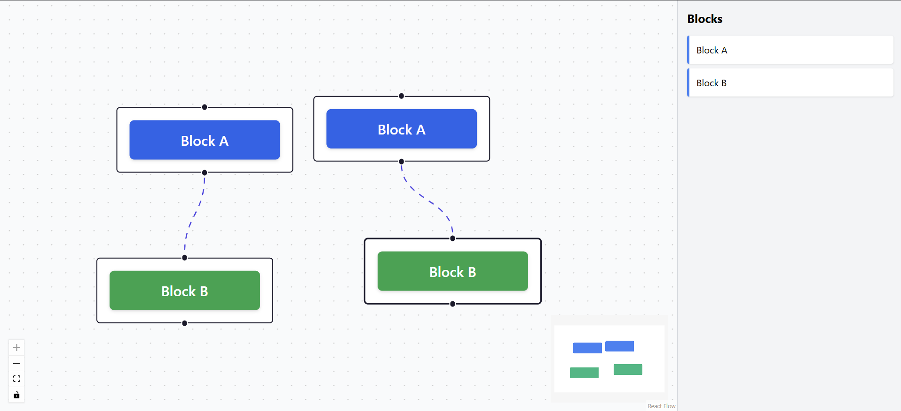
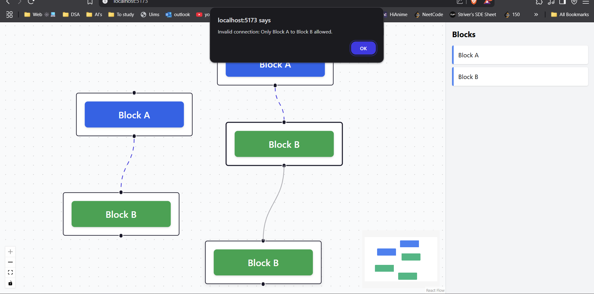
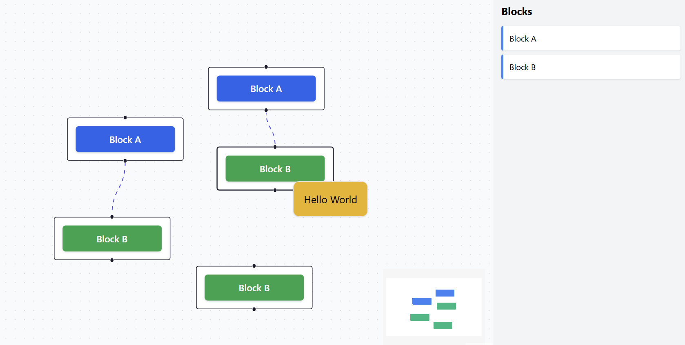

# React Flow Interaction Board

This project is a task-based implementation demonstrating the use of **React**, **React Flow**, **Tailwind CSS**, and **Vite** to build a drag-and-drop interaction board. It supports connection logic, custom styling, and interactive UX behavior.

> ✅ **Live Demo:** [https://ritik.lancway.com](https://ritik.lancway.com)

---

## 📋 Task Description

I was asked to build a UI that:

* Shows a draggable panel with Block A and Block B.
* Allows dragging blocks into a central canvas.
* Enables connecting only from Block A → Block B.
* Blocks invalid connections (like B → A).
* Displays a custom context menu with "Hello World" when right-clicked on a block.

Additional features implemented:

* Node deletion via `Delete` key
* Animated connections
* Color-differentiated blocks (Blue: A, Green: B)
* Live deployed on Hostinger

---

## 🚀 Features

* 🎨 Tailwind-styled drag-and-drop blocks
* 🔌 Valid connections (`Block A → Block B`)
* 🚫 Alerts on invalid connections
* 🖱️ Custom context menu on right-click
* 💥 Delete key support for node/edge deletion
* 🗺️ MiniMap, controls, and background grid
* 🌐 Hosted on: **ritik.lancway.com**

---

## 📁 Project Structure

```
src/
├── components/
│   ├── FlowCanvas.jsx
│   ├── BlockPanel.jsx
│   └── ContextMenu.jsx
├── constants/
│   └── blocks.js
├── utils/
│   └── connectionRules.js
├── App.jsx
├── main.jsx
└── index.css
```

---

## 🧪 Installation & Usage

```bash
git clone https://github.com/your-username/react-flow-interaction-board.git
cd react-flow-interaction-board
npm install
npm run dev
```

Visit: [http://localhost:5173](http://localhost:5173)

---

## 🛠️ Tech Stack

* React + Vite
* TailwindCSS
* React Flow
* Deployed on Hostinger (Custom domain)

---

## 🖼️ Project Outcome

### 1️⃣ Valid Connection (Block A → Block B)



---

### 2️⃣ Invalid Connection (Block B → Block A)



---

### 3️⃣ Right-click Context Menu




---

